# 🎓 Academic Management System

A full-stack **Academic Management System** developed collaboratively by multiple teams using  
**Spring Boot, MySQL, HTML, CSS, and JavaScript**.

The project follows a **modular, team-based architecture**, where each team is responsible for specific modules while integrating into a single unified system.

---

## 🚀 Project Overview

This system is designed to digitize and simplify academic operations such as:

- Course and intake management  
- Staff and student handling  
- Enrollment, attendance, and exams  
- Secure authentication and authorization  
- Centralized dashboard and analytical reports  

Each team independently developed their module and ensured seamless integration using shared REST APIs and a common database.

---

## 🧩 Team Responsibilities, Individual Contributions & Screenshots

---

## 🔹 Team A – Core Management, Security & Frontend

### Responsibilities
- Application security and authentication  
- Frontend UI design  
- Course and staff core management  
- Dashboard and navigation  
- Core database design and integration  

### 👥 Contributors
| Name | Contribution | Email |
|------|-------------|-------|
| Hemant | Security, Frontend UI, CRUD, DB Design | hemant@email.com |
| Abhishek | Staff Entity, DB Design | abhishek@email.com |
| Anurag | Course Entity Design, CRUD | anurag@email.com |
| Rohit | Frontend UI, Course & Staff CRUD | rohit@email.com |

### Individual Contributions
- **Security & Database Design:** Hemant, Abhishek  
- **Frontend Design (UI/UX):** Hemant, Rohit  
- **Staff Entity Design:** Abhishek  
- **Course Entity Design:** Anurag  
- **Course & Staff CRUD Operations:** Rohit, Anurag, Hemant  
- **Backend Development:** All Team A members collaboratively  

### 🖼️ Team A – UI Screenshots
| Landing Page 
|-------------|
| 

| Login | Dashboard |
|------|----------|
|  | 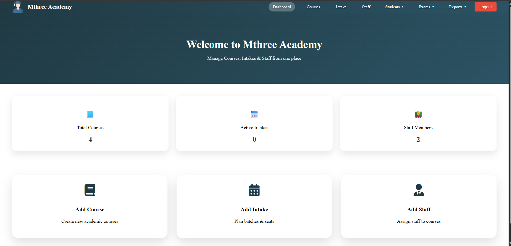 |

| Add Course | Courses |
|-----------|-------------|
| 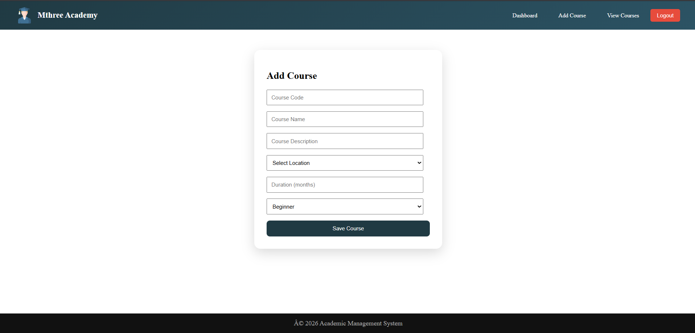 | 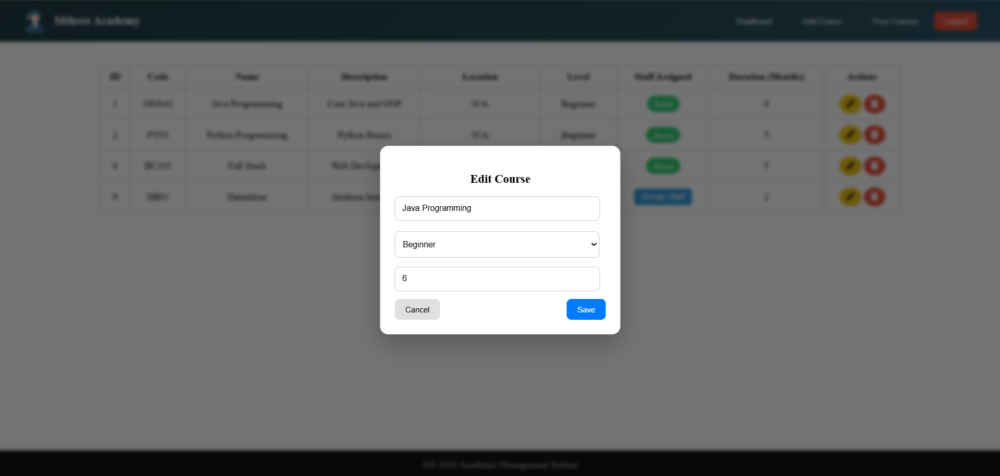 |

| Course Edit | View Courses |
|-----------|-------------|
|  |  |

| Add Intake | Add Staff |
|-----------|-----------|
|  |  |

| View Stafs | Logout |
|--------------------|--------|
|  |  |

📁 Additional screenshots: `Screenshots/team-a/`

---

## 🔹 Team B – Student, Intake & Enrollment Management

### Responsibilities
- Student management  
- Intake creation and seat management  
- Student enrollment into courses  
- Location management  
- Integration support for the Exam module  

### 👥 Contributors
| Name | Contribution | Email |
|------|-------------|-------|
| Jatin | Student Management (CRUD) | jatin@email.com |
| Nithisha | Intake Management & Seat Logic | nithisha@email.com |
| Sunil | Enrollment & Course–Intake Mapping | sunil@email.com |
| Prajakta | Location Management & Validation | prajakta@email.com |

### Individual Contributions
- **Jatin:** Student Management (Add, Edit, View, Delete)  
- **Nithisha:** Intake Management with seat allocation & OPEN/CLOSED logic  
- **Sunil:** Student Enrollment & course–intake mapping  
- **Prajakta:** Location Management with validations  

### 🖼️ Team B – UI Screenshots
| Students | Add Student |
|---------|-------------|
|  |  |

| Edit Student | Intake Creation |
|-------------|----------------|
|  |  |

| Seat Allocation | Enrollment |
|----------------|------------|
|  |  |

| Location | Location Mapping |
|---------|------------------|
|  |  |

📁 Additional screenshots: `Screenshots/team-b/`

---

## 🔹 Team D – Exams & Results Module

### Responsibilities
- Exam creation and execution  
- Exam submission and evaluation  
- Result processing and display  

### 👥 Contributors
| Name | Contribution | Email |
|------|-------------|-------|
| Anurag | Create & Submit Exam (Backend) | anurag@email.com |
| Rajeshwari | Start Exam, Entity Design | rajeshwari@email.com |
| Varsha | Result Page & Frontend | varsha@email.com |
| Riya | Frontend & Data Handling | riya@email.com |

### 🖼️ Team D – UI Screenshots
| Create Exam | Start Exam |
|------------|------------|
|  | 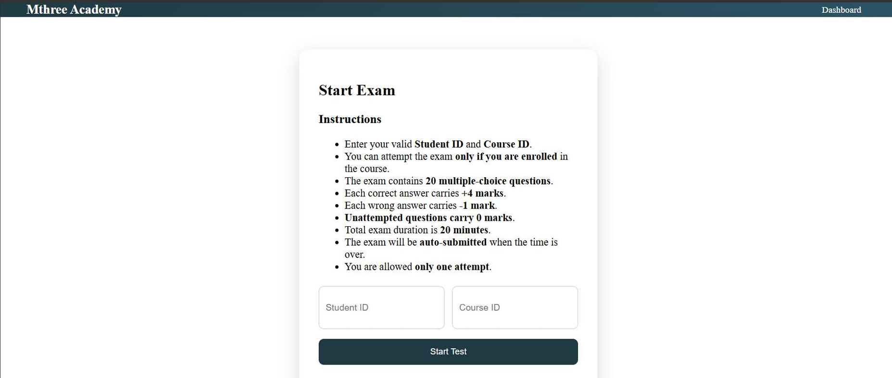 |

| Question Page | Submit Exam |
|---------------|------------|
| 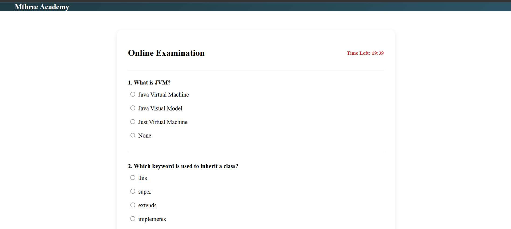 |  |

| Result Page 
|-------------|
| 


📁 Additional screenshots: `Screenshots/team-d/`

---

## 🔹 Team E – Reports & Analytics Module

### Responsibilities
- Reports module design and architecture  
- Course, staff, student, and exam reports  
- Reports dashboard UI  
- Aggregated data handling using optimized SQL queries  
- Backend integration with core modules  

### 👥 Contributors
| Name | Contribution | Email |
|------|-------------|-------|
| Aishwarya | Staff Reports & Workload Mapping | aishwarya@email.com |
| Ankita | Student & Exam Reports | ankita@email.com |
| Pavan | Exam Reports & Statistics | pavan@email.com |
| Sridhar | Course Reports & Dashboard | sridhar@email.com |

### 🖼️ Team E – UI Screenshots
| Reports Dashboard | Course Report |
|------------------|---------------|
| 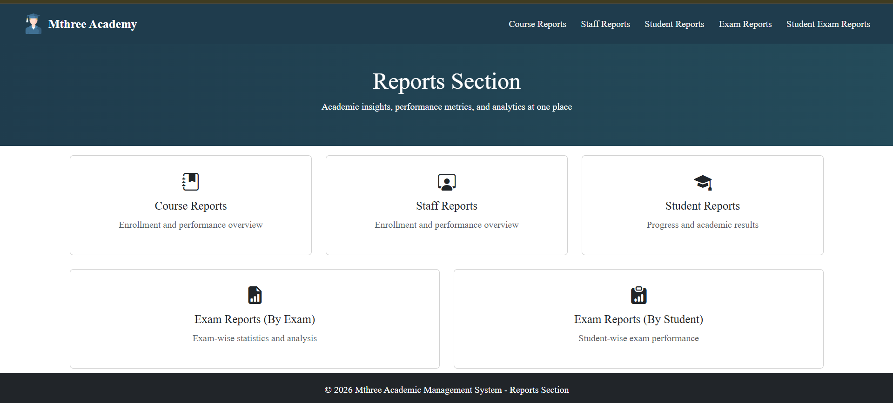 | 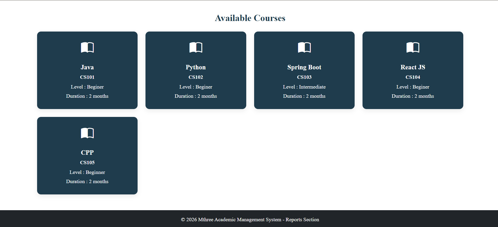 |

| Course Report | Course Report |
|------------------|---------------|
| 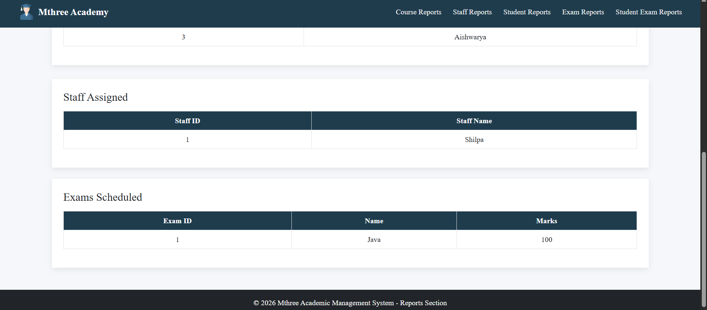 | 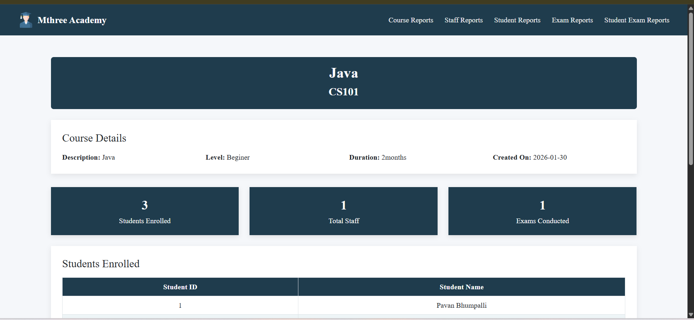 |

| Staff Report | Staff Report |
|--------------|----------------|
| 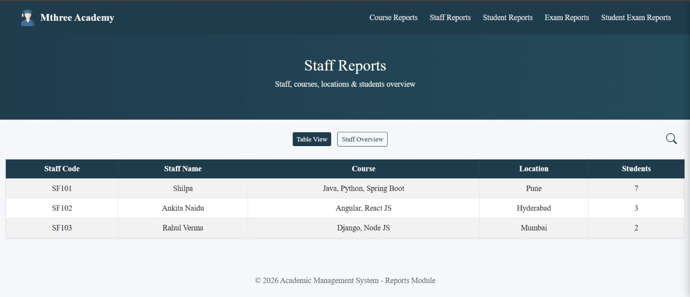 | 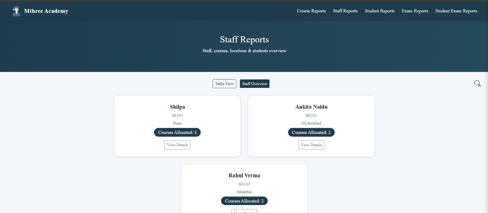 |

| Staff Report | Staff Report |
|--------------|----------------|
| 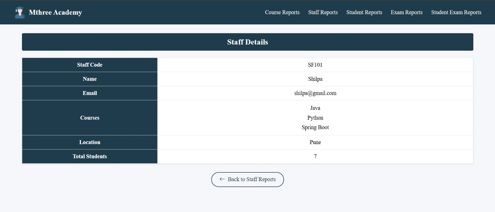 | 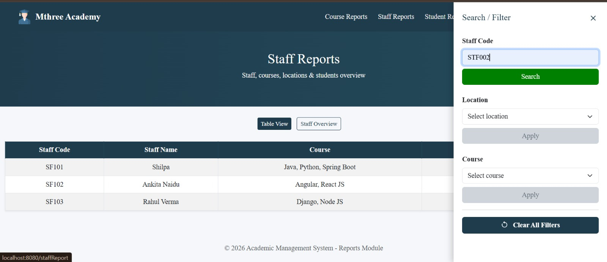 |

| Staff Report | Staff Report Filter |
|--------------|----------------|
| 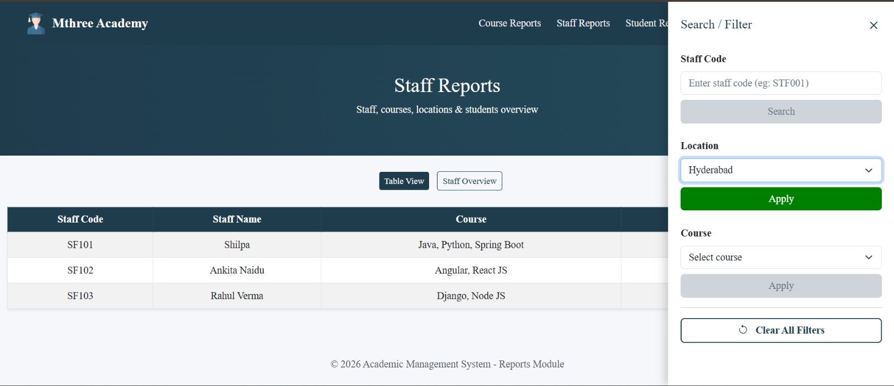 | 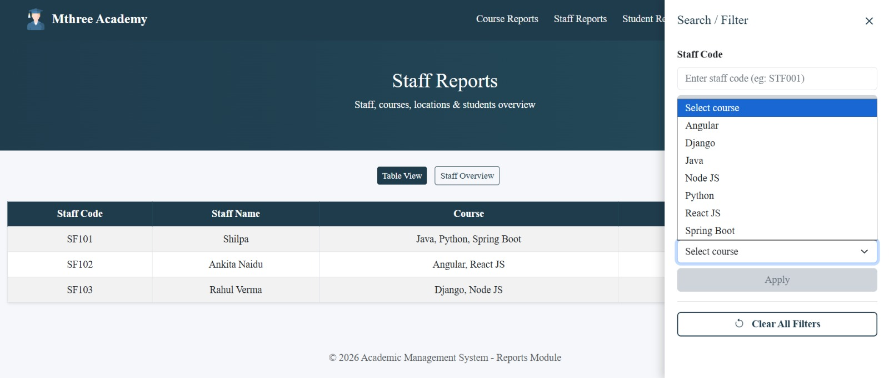 |

| Staff Report | Staff Report |
|--------------|----------------|
| 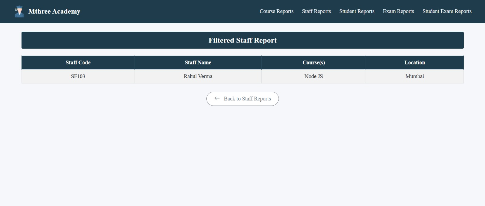 | 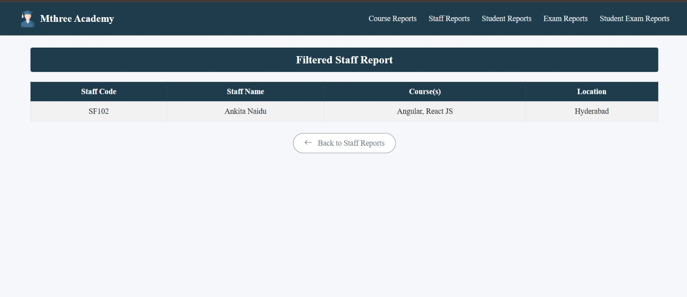 |

| Student Report | Student Report |
|--------------|----------------|
| 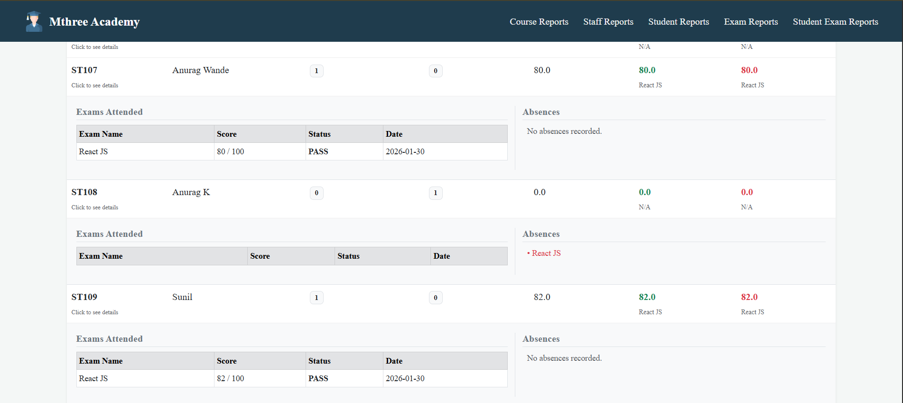 |  |

| Exam Report | Exam Report-1 |
|-------------|------------------|
| 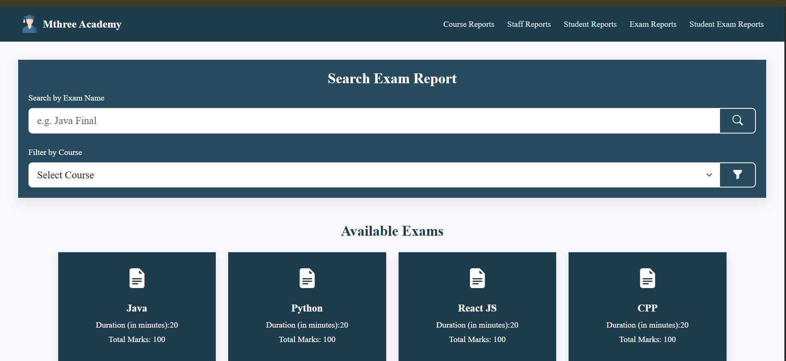 | 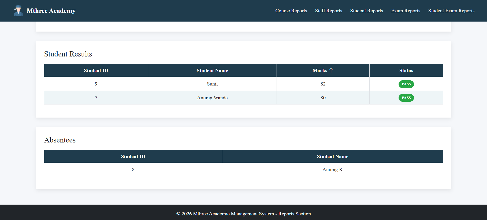 |

| Exam Report-2 | Exam Report-3 |
|-------------|------------------|
|  |


📁 Additional screenshots: `Screenshots/team-e/`

---

## 🔐 Default Admin Credentials
```text
Username: admin
Password: admin123
